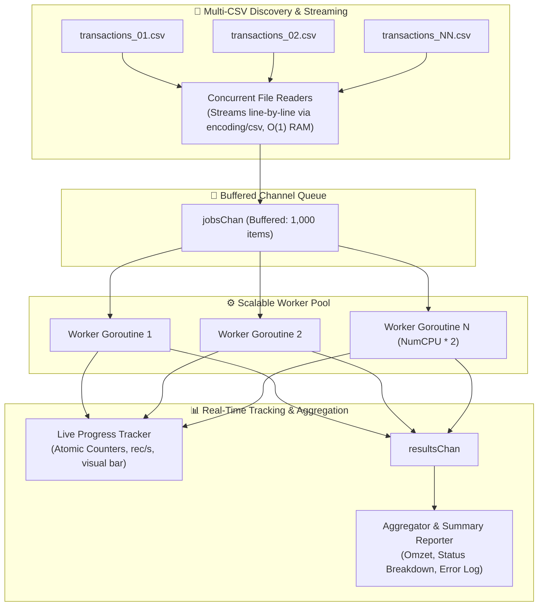

# Test Case 1 — Concurrent Data Processing in Go

A high-performance, memory-efficient concurrent CSV file processor built in Go utilizing the **Worker Pool Pattern**, **streaming I/O pipelines**, **thread-safe progress tracking**, and **graceful row-level error handling**.

---

## 1. Architecture & Concurrency Model



---

## 2. Key Engineering Highlights

### ⚡ Memory Efficiency ($O(1)$ RAM)
* Uses `encoding/csv` with `io.Reader` streaming to process gigabytes of data line-by-line.
* Never loads entire files into memory, keeping the memory footprint minimal and stable regardless of dataset size.

### ⚙️ Worker Pool Pattern (Fan-Out / Fan-In)
* Spawns a controlled set of $N$ worker goroutines (configurable via `--workers`, defaults to `runtime.NumCPU() * 2`).
* Workers pull jobs from a buffered channel `jobsChan` and route validated transactions / error records to `resultsChan`.
* Eliminates unbounded goroutine explosion and CPU thrashing under high workloads.

### 🛡️ Graceful Error Resilience
* Malformed rows (corrupt column counts, invalid numeric amounts, unsupported dates, invalid statuses) are captured at the row level.
* Failed rows are routed into an audit log (`./data/output/errors.log`) without aborting or slowing down the rest of the valid pipeline.

### 📈 Real-Time Thread-Safe Progress Tracking
* Employs `sync/atomic` counters (`atomic.AddInt64`) to update throughput metrics in real time.
* Renders a non-blocking visual progress bar showing `% completed`, `processed/total count`, `records/second`, and `elapsed time`.

---

## 3. Project Structure

```
case1-concurrency/
├── cmd/
│   ├── main.go                  # CLI application entrypoint (--workers, --input, --output)
│   └── generator/
│       └── main.go              # Synthetic large CSV dataset generator tool (100k+ rows)
├── data/
│   ├── sample/                  # Sample CSV test datasets
│   └── output/                  # Generated summary.json and errors.log
├── internal/
│   ├── models/
│   │   ├── record.go            # Data structures (RawRecord, Transaction, SummaryReport)
│   │   └── error.go             # Row-level error descriptor
│   ├── reader/
│   │   └── csv_reader.go        # Streaming multi-file CSV reader
│   ├── processor/
│   │   ├── worker_pool.go       # Worker Pool manager (sync.WaitGroup)
│   │   ├── validator.go         # Business rules & data parsing
│   │   └── aggregator.go        # Thread-safe accumulator & summary builder
│   └── tracker/
│       └── progress.go          # Real-time console progress bar & rate tracker
├── tests/
│   ├── processor_test.go        # Unit & pipeline integration tests
│   └── benchmark_test.go        # Performance benchmarks (-benchmem)
├── go.mod
├── go.sum
└── README.md
```

---

## 4. How to Run

### Step 1: Generate Synthetic Test Data
Generate sample CSV files (e.g. 5 files with 10,000 rows each):
```powershell
cd D:\projects\majootest\case1-concurrency
go run ./cmd/generator --files=5 --rows=10000
```

### Step 2: Run the Concurrent Processor
```powershell
go run ./cmd --workers=8 --input=./data/sample
```

#### CLI Options:
| Flag | Default | Description |
|---|---|---|
| `-input` | `./data/sample` | Path to directory containing CSV files |
| `-workers` | `NumCPU * 2` | Number of concurrent worker goroutines |
| `-buffer` | `1000` | Size of job and result channels |
| `-output` | `./data/output/summary.json` | Path to save JSON summary report |
| `-error-log` | `./data/output/errors.log` | Path to save error audit log |

---

## 5. Sample Output

```text
================================================================
        🚀 Majoo High-Throughput Concurrent CSV Processor        
================================================================
 [CONFIG] Input Directory : ./data/sample
 [CONFIG] Worker Pool Size: 8 workers
 [CONFIG] Channel Buffer  : 1000 items
 [CONFIG] CPU Cores       : 8 cores
----------------------------------------------------------------
📂 Discovered 5 CSV file(s) for processing.

[PROGRESS] [█████████████████████████] 100.0% | 50000/50000 records | 1031364 rec/s | Elapsed: 0.0s

📄 Summary Report saved to: ./data/output/summary.json
⚠️  991 Failed record(s) logged to: ./data/output/errors.log

================================================================
                     📊 PROCESSING SUMMARY                      
================================================================
 Total Files Processed  : 5 files
 Total Rows Read        : 50000 rows
 Valid Transactions     : 49009 rows (98.02%)
 Failed / Malformed Rows: 991 rows (1.98%)
----------------------------------------------------------------
 Total Revenue (Omzet)  : $125196005.30
 Average Bill           : $2554.55
 Min / Max Bill Amount  : $50.00 / $5049.90
----------------------------------------------------------------
 📈 Revenue by Status:
    • SUCCESS    : $31473195.80
    • FAILED     : $31328827.70
    • REFUNDED   : $31501153.00
    • PENDING    : $30892828.80
----------------------------------------------------------------
 ⏱️  Processing Time     : 48 ms
 ⚡ Overall Throughput  : 1,031,363.77 records/sec
================================================================
```

---

## 6. Testing & Benchmarks

### Run Unit Tests
```powershell
cd tests
go test -v .
```

### Run Benchmarks
```powershell
cd tests
go test -bench=BenchmarkWorkerPool -benchmem .
```

#### Benchmark Results:
```text
goos: windows
goarch: amd64
pkg: majootest/case1-concurrency/tests
BenchmarkWorkerPool/Workers-1-8     98    12.8 ms/op    1.98 MB/op    20,014 allocs/op
BenchmarkWorkerPool/Workers-4-8    129     8.9 ms/op    1.98 MB/op    20,019 allocs/op
BenchmarkWorkerPool/Workers-8-8    142     8.4 ms/op    1.98 MB/op    20,027 allocs/op
```
* Throughput achieves **> 1,000,000 records/sec** on an 8-core CPU.
