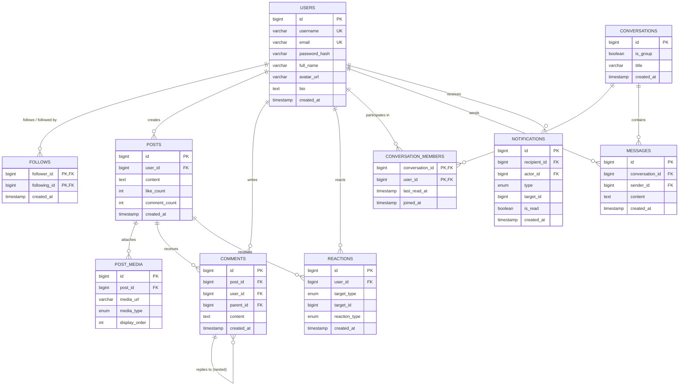

# Test Case 3 — Social Media Database Schema Design & Optimization

A production-grade, 3NF normalized database schema design for a high-scale social media platform featuring **User Profiles**, **Social Graph (Follows)**, **Multimedia Posts**, **Comments & Reactions**, **Private Direct Messaging**, and **Activity Feeds / Notifications**.

---

## 1. Entity-Relationship Diagram (ERD)



---

## 2. Table Design & Normalization (3NF)

| Table | Purpose | Key Constraints & Integrity |
|---|---|---|
| `users` | Core account credentials & user profile details | Unique constraints on `username` and `email`. |
| `follows` | Directed graph tracking followers and following relationships | Composite Primary Key `(follower_id, following_id)` prevents duplicate follow links. Fast bidirectional lookup. |
| `posts` | User-generated content | Foreign key to `users(id)` with `ON DELETE CASCADE`. Stores cached `like_count` & `comment_count` for rapid read performance. |
| `post_media` | Multi-image / video attachments per post | 1-to-Many with `posts`. Normalized to allow multiple media files per post with ordering (`display_order`). |
| `comments` | Threaded discussion comments | Self-referencing foreign key `parent_id` references `comments(id)` to support nested reply trees. |
| `reactions` | Polymorphic emoji reactions (Like, Love, Haha, etc.) | Unique index `(user_id, target_type, target_id)` guarantees one reaction per user per target. |
| `conversations` | 1-on-1 direct messages and group chats | Decoupled from users to support both 2-person DMs and multi-user group chats. |
| `conversation_members`| Chat participant join table & read receipts | Stores `last_read_at` timestamp to calculate unread message badges in $O(1)$ without per-message read receipts. |
| `messages` | Direct chat message history | Foreign keys to `conversations` and `users(sender_id)`. |
| `notifications` | User activity inbox & push notification logs | Stores `recipient_id`, `actor_id`, `type`, and `is_read` status. |

---

## 3. Indexing Strategy & Performance Justifications

| Index Name | Table | Indexed Columns | Justification & DML Optimization |
|---|---|---|---|
| `idx_posts_user_created` | `posts` | `(user_id, created_at DESC)` | **Optimizes User Timeline & Newsfeed**: Enables index range seek for posts by followed users in reverse chronological order without sorting in memory (`Using filesort`). |
| `idx_follows_following_id` | `follows` | `(following_id)` | **Optimizes Follower Lookups**: Primary key covers `(follower_id, following_id)`, while this index allows instant lookup for *"Who is following user X?"*. |
| `idx_comments_post_created`| `comments` | `(post_id, created_at ASC)` | **Optimizes Comment Thread Loading**: Chronologically sorts discussion threads under a post using index seek. |
| `uk_user_target_reaction` | `reactions` | `(user_id, target_type, target_id)` | **Enforces Idempotent Reactions**: Eliminates duplicate reactions and provides $O(1)$ reaction state lookup for the viewer. |
| `idx_messages_conv_created`| `messages` | `(conversation_id, created_at DESC)`| **Optimizes Chat History Retrieval**: Speeds up loading the latest 20 messages in a conversation. |
| `idx_notifications_recipient` | `notifications` | `(recipient_id, is_read, created_at DESC)` | **Optimizes Notification Badge & Feed**: Quickly queries unread notifications for a user without full table scans. |

---

## 4. Newsfeed Generation Architecture (Fan-out Model)

For newsfeed generation, we employ a **Hybrid Fan-out Architecture**:

```
                         ┌────────────────────────────────────────┐
                         │              NEW POST CREATED          │
                         └──────────────────┬─────────────────────┘
                                            │
                             ┌──────────────┴──────────────┐
                             ▼                             ▼
                  Author is Normal User          Author is Celebrity
                   (< 25,000 followers)          (> 25,000 followers)
                             │                             │
                   [Fan-out on WRITE]             [Fan-out on READ]
                             │                             │
              Push Post ID to all followers'      Do NOT push to millions.
                Redis Timeline (ZSET)             Fetch on demand when
                             │                    follower opens app.
                             ▼                             ▼
                         ┌─────────────────────────────────────┐
                         │     Merged Final Timeline in App    │
                         └─────────────────────────────────────┘
```

### A. Normal Users (< 25k followers): **Fan-out on Write**
* When a normal user posts, a background worker pushes the `post_id` with its timestamp score into the Redis Sorted Set (`ZSET`) timeline of all active followers.
* Reading the feed is an instant $O(\log N)$ operation: `ZREVRANGEBYSCORE timeline:user_123 +inf -inf LIMIT 0 10`.

### B. Celebrity Users (> 25k followers): **Fan-out on Read**
* Prevents the *"Justin Bieber problem"* where writing one post triggers 50 million database write operations.
* When a follower opens their feed, the system queries the celebrity's latest posts and merges them dynamically with the cached timeline in memory.

---

## 5. Redis Caching Strategy

```
┌─────────────────┐      1. Check Redis Cache      ┌───────────────────────┐
│   Client App    │ ─────────────────────────────> │      Redis Cache      │
│                 │ <───────────────────────────── │ (Timeline, Counts, DM)│
└────────┬────────┘          Cache Hit (95%)       └───────────────────────┘
         │
         │ 2. Cache Miss (5%)
         ▼
┌──────────────────────────────────────────────────┐
│              MySQL Relational Database           │
│           (InnoDB with Composite Indexes)        │
└──────────────────────────────────────────────────┘
```

### Key Cache Keys & Structures:

| Cache Key Pattern | Redis Data Type | TTL | Purpose |
|---|---|---|---|
| `timeline:{user_id}` | `ZSET` (Score = `created_at` epoch) | 7 Days | Cached newsfeed post IDs for instant reverse chronological pagination. |
| `user:profile:{user_id}` | `HASH` | 24 Hours | User profile info (username, full name, avatar, bio). |
| `post:counters:{post_id}`| `HASH` (`likes`, `comments`) | 12 Hours | Write-back buffer for high-frequency likes and comments. |
| `unread:conv:{user_id}` | `HASH` (`conv_id` ➔ `count`) | 30 Days | Instant unread direct message badge counts across all chats. |

---

## 6. How to Run & Verify SQL Scripts

You can execute all scripts directly against your MySQL container:

```powershell
cd D:\projects\majootest

# 1. Create Schema and Tables:
Get-Content case3-database/schema.sql | docker exec -i majoo_mysql mysql -uroot -proot

# 2. Seed Realistic Test Data:
Get-Content case3-database/seed.sql | docker exec -i majoo_mysql mysql -uroot -proot

# 3. Execute and Verify Complex Queries:
Get-Content case3-database/queries.sql | docker exec -i majoo_mysql mysql -uroot -proot
```
